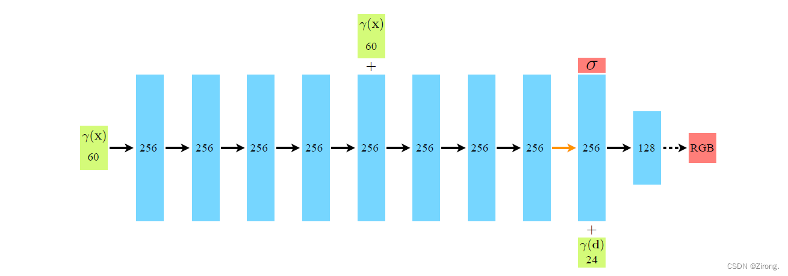

# 计算机图形学 - Info-NeRF Jittor

陈新	计研三一	2022210877

## 原理

### NeRF

通过神经网络，输入位置和方向，输出该点的颜色和体密度
$$
(x, d) \rarr (c, \sigma)
$$
因此能够利用 Ray marching、体渲染的方式进行渲染。

而位置/方向信息可以通过 Positional Encoding 的方式，将高频函数变为低频函数，更加适宜深度神经网络的学习特性
$$
\gamma(p) = \left(\sin(2^{0} \pi p), \cos(2^{0} \pi p), \ldots, \sin(2^{L - 1} \pi p), \cos(2^{L - 1} \pi p)\right)
$$


神经网络共10层，输入位置与方向

第一层为输入维度到256维的线性层，之后8层256维的线性层。其中第四层重新添加输入信息以强化记忆；第八层额外添加特征层以学习神经辐射场参数。

最后降维到3，即RGB信息




### 体渲染

每个点发出的光强与该点的亮度 $c=(R, G, B)$ 和体密度 $\sigma$ 成正比，且光线穿过有密度的物体会发生衰减，所以到达像素位置时需要乘以一个衰减系数 $T$

考虑一条光线 $r(t) = x + td$ ，在直线上一点 $r(t)$ 上发出的光强是 $\sigma(r(t))c(r(t), d) \text{d}t$ ，从该点到视点发生的衰减系数 $T(t) = e^{-\int_0^t \sigma(r(s)) \text{d}s}$ ，因此该点对像素颜色的贡献为 $T(t) \sigma(r(t)) c(r(t), d) \text{d}t$ ，对光线上的每个点做积分即可得到像素的颜色
$$
c(x, d) = \sum_{i=1}^N T_i(1 - e^{-\sigma_i \delta_i}) c_i \\
其中 \delta_i = t_{i+1} - t_i, T_i = e^{-\sum_{j=1}^{i-1} \sigma_j \delta_i}
$$
因为只有少部分光线击中了采样点，所以在体渲染光线上取采样点时，先粗采样，即均匀+少量随机取点；然后通过计算其 pdf，计算出 density，并加权重新细采样。


### InfoNeRF

损失函数由两部分组成（由于对 lego 样例无效，因此删除 $L_{KL}$）：
$$
L = L_{RGB} +\lambda L_{entropy} \\
{L}_{entropy} = \frac{1}{|\mathcal{R}_s|+|\mathcal{R}_u|}\sum_{r\in \mathcal{R}_s \cup\mathcal{R}_u}M(r)\odot H(r)
$$
因为只有少部分光线击中了采样点，剩下的部分只起到噪音的作用。最小化光线的信息熵有助于减小重建过程中的噪音。


## 代码结构

`main.py` 为程序主入口

`create_nerf` 创建了一个 `model.NeRF` 网络

`render` 为体渲染计算函数


## 运行方式

训练：

```
python main.py --config configs/infonerf/synthetic/lego.txt
```

渲染全部 200 个 pose 并合成视频：

```
python main.py --config configs/infonerf/synthetic/lego.txt --testskip 1 --render_test --render_only
```


## 实验

### 环境

Windows 11，RTX2080Ti

参数见 `configs/infonerf/synthetic/lego.txt`

训练完成的模型数据见 `log` 文件夹


### 训练结果

| Iteration | PSNR    | PSNR_redefine      |
| --------- | ------- | ------------------ |
| 8000      | 18.4665 | 18.743877410888672 |
| 50000     | 19.0656 | 19.5442            |

